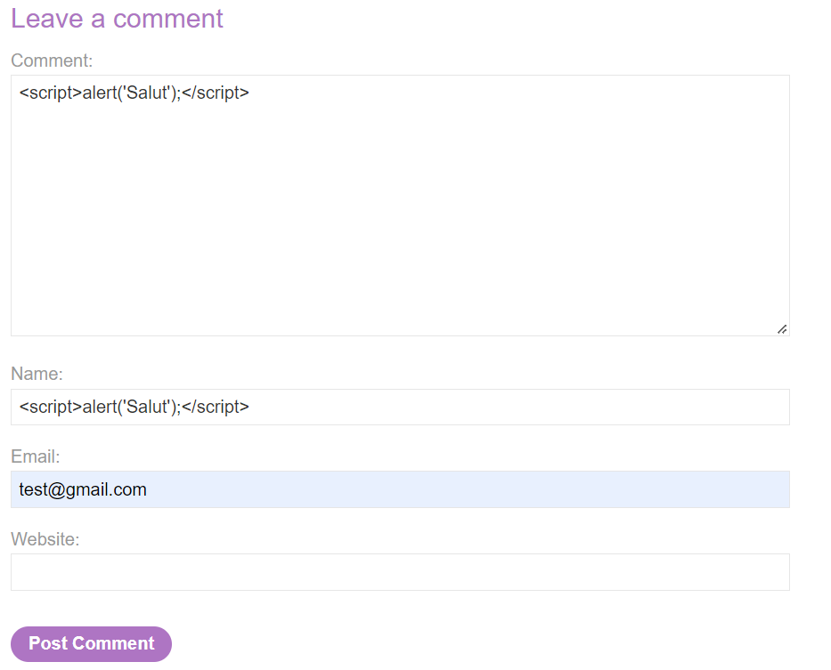

# TP BurpLabs - XSS-Ci-ID

---

---

# 2. XSS (Cross Site Scripting)

## 2.1

This lab contains a [stored cross-site scripting](https://portswigger.net/web-security/cross-site-scripting/stored) vulnerability in the comment functionality.

To solve this lab, submit a comment that calls the `alert` function when the blog post is viewed.

Pour résoudre ce lab il suffit de mettre des balises `<script>` avec la fonction `alert()` qui seront interprété par le navigateur l’or de leurs affichage. C’est a dire par exemple dans des commentaires ou un nom d’utilisateur. A chaque affichage de la ligne sur une page le script s’exécutera en local.




## 2.2

This lab demonstrates a simple web message vulnerability. To solve this lab, use the exploit server to post a message to the target site that causes the `print()` function to be called.

Pour résoudre ce lab il faut aller sur l’exploit server proposé en haut de la page et changer la requête afin qu’une ifram soit chargé dans un site pirate. Cette ifram sera :

`<iframe src="[https://0a6300730301fc5bc0461a6c002100b9.web-security-academy.net/](https://0a6300730301fc5bc0461a6c002100b9.web-security-academy.net/)" onload="this.contentWindow.postMessage('','*')">`

L’ifram sera chargé au chargement de la page d’exploitation. Elle donnera l’impression d’être sur le site normal or il s’agira d’un site attaquant qui affiche juste a l’intérieur le site normal. `onload` fait en sorte que si l’ifram est chargé on execute un script. Ici `this.contentWindow.postMessage` permet de mettre du texte html dans l’ifram. Pour finir la balise `img` tentera de mettre une image pour nom “1” (Elle n’existe pas) mais n’étant pas existante on passera dans le `onerror` qui exécutera la fonction `print`.


## 2.3

This lab demonstrates a reflected DOM vulnerability. Reflected DOM vulnerabilities occur when the server-side application processes data from a request and echoes the data in the response. A script on the page then processes the reflected data in an unsafe way, ultimately writing it to a dangerous sink.

To solve this lab, create an injection that calls the `alert()` function.

Il faut lancer BurpSuite afin de trouver une faille. Ensuite il suffit de réfléchir et de rentrer `\"-alert(1)}//` dans la search bar afin d’injecter le code qui sera ensuite exécuté.


# **3. Command Injection**

## 3.1

This lab contains an [OS command injection](https://portswigger.net/web-security/os-command-injection) vulnerability in the product stock checker.

The application executes a shell command containing 
user-supplied product and store IDs, and returns the raw output from the
 command in its response.

To solve the lab, execute the `whoami` command to determine the name of the current user.


Il faut selectionner toute la partit dans request et faire clique droit puis send to the repeater


Ajouter `& whoami`

Encoder sous forme d’url pour rendre utilisable la commande et passez store à 1


Il faut ensuite rajouter  `#` à la fin et l’encoder pour rendre la commande utilisable. Le `#` permet de mettre en commentaire la fin de la requête.


Remplacer par `cat [chemain dans l’erreur] #`

Le fichier est un script qui va faire office de traitement de la requête


On peut voir `$1` qui correspond à la 1er variable soit `productId` et `$2` a la seconde donc `storeId`

C’est donc pour ça que l’on a besoin de 2 paramètres mais avec le `#` à la fin cela permet de ne plus l’interpréter et juste de prendre whoami en second paramètre.

## 3.2

This lab contains a blind [OS command injection](https://portswigger.net/web-security/os-command-injection) vulnerability in the feedback function.

The application executes a shell command containing the 
user-supplied details. The output from the command is not returned in 
the response. However, you can use output redirection to capture the 
output from the command. There is a writable folder at:

```bash
/var/www/images/
```

The application serves the images for the product catalog 
from this location. You can redirect the output from the injected 
command to a file in this folder, and then use the image loading URL to 
retrieve the contents of the file.

To solve the lab, execute the `whoami` command and retrieve the output.


Send la requête post dans le repeater 


Créer un fichier dans le dossier /var/www/images avec la commande `||whoami>/var/www/images/output.txt||`


Il faut maintenant rechercher pour changer une image par notre fichier `output.txt`


Remplacer le fichier image par notre fichier `output.txt`


# **4. Information Disclosure**

## 4.1

This lab leaks its source code via backup files in a hidden directory. To solve the lab, identify and submit the database password, which is hard-coded in the leaked source code.

Il suffit d’aller sur le fichier `robots.txt` qui permet de dire au robots de google de ne pas référencer certain fichier. Ici il est lisible donc possible de voir qu’il existe un dossier `/backup`


Il faut alors aller dans le dossier `/backup`


Voici alors la backup du serveur


Le résultat est donc `3u38mu0hqpdnstk4z1pp74rx1qmbydzb`


